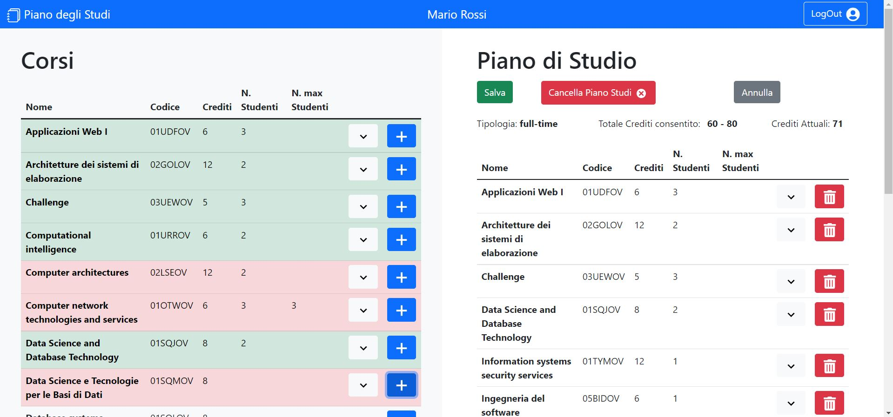

# Project: Piano di Studi

## React Client Application Routes

- Route `/`: Home-page, Home-page Logged-In and Editing
- Route `/login`: Login
- Route `*` : Page Not Found

## API Server

- GET `/courses`
  - Request Body: None
  - Request Parameters: None
  - Response `200 OK` (success), `500` (internal server error)
  - Response body:
    ```
    [{
      "codice": '02GOLOV',
      "nome": 'Architetture dei sistemi di elaborazione',
      "crediti": "12",
      "studenti_partecipanti": "2",
      "max_studenti": '',
      "propedeutico": null
    },...
    ```

- GET `/courses/incompatibile/<codice>`
  - Request Body: None
  - Request Parameters: codice del corso
  - Response `200 OK` (success), `404` (Not Found), `500` (internal server error)
  - Response body:
    ```
    [{
      "codiceIncompatibile": '01SQJOV',
      "nomeIncompatibile": 'Data Science and Database Technology'
    },
    {
      "codiceIncompatibile": '01SQLOV',
      "nomeIncompatibile": 'Database systems'
    }]
    ```

- GET `/courses/propedeutico/<codice>`
  - Request Body: None
  - Request Parameters: codice del corso
  - Response `200 OK` (success), `404` (Not Found), `500` (internal server error)
  - Response body:
    ```
    "Web Applications I"
    ```
    

- GET `/PianoStudio`
  - Request Body: None
  - Request Parameters: None
  - Response `200 OK` (success), `500` (internal server error)
  - Response body:
    ```
    [{
      "codice": '01OUZPD',
      "nome": 'Model based software design',
      "crediti": "4",
      "studenti_partecipanti": "1",
      "max_studenti": null,
      "propedeuticità": null
    },...
    ```

- PUT `/PianoStudio`
  - Request Body: tipologia Piano Studio 
    ```
    {tip_str: "full-time"}
    ```
  - Request Parameters: None
  - Response: `200 OK` (success), `422` (the request body is not valid), `503` (Service Unavailable)
  - Response body: None

- PUT `/SavePianoStudio`
  - Request Body: array corsi da inserire nel Piano Studio, array corsi da eliminare dal piano studio 
    ```
    [{
      codice: '01UDFOV',
      nome: 'Applicazioni Web I ',
      crediti: 6,
      studenti_partecipanti: 4,
      max_studenti: null,
      propedeutico: null
    },...
    ```
    ```
    [{
      codice: '01OTWOV',
      nome: 'Computer network technologies and services',
      crediti: 6,
      studenti_partecipanti: 3,
      max_studenti: 3,
      propedeutico: null
    },...
    ```
  - Request Parameters: None
  - Response: `200 OK` (success), `503` (Service Unavailable)
  - Response body: None


- PUT `/DeletePianoStudio`
   - Request Body: piano studio 
      ```
      [{
        codice: '01UDFOV',
        nome: 'Applicazioni Web I ',
        crediti: 6,
        studenti_partecipanti: 4,
        max_studenti: null,
        propedeutico: null
      },...
      ```
  - Request Parameters: None
  - Response: `204 No Content` (success),`503` (Service Unavailable)
  - Response body: None


- GET `/user`
  - Request Body: None
  - Request Parameters: None
  - Response `200 OK` (success), `404` (Not Found), `500` (internal server error)
  - Response body:
    ```
    {
      "id":2,
      "username":"miriana@polito.it",
      "nomecompleto":"Miriana Martini",
      "tipologia_pianostudio":"part-time"
    }
    ```

- POST `/sessions`
  - Request Body: 
    ```
    {username: "test@polito.it", password: "password"}
    ```
  - Request Parameters: None
  - Response: `200 OK` (success), `401` (Unauthorized)
  - Response body: 
    ```
    {
      "id":1,
      "username":"test@polito.it",
      "nomecompleto":"Mario Rossi",
      "tipologia_pianostudio":"full-time"
    }
    ```

- DELETE `/sessions/current`
  - Request Body: None
  - Request Parameters: None
  - Response: `200 ` (success)
  - Response body: None

- GET `/sessions/current`
  - Request Body: None
  - Request Parameters: None
  - Response `200 OK` (success), `401` (Unauthorized)
  - Response body: None

## Database Tables

- Table `Utenti` - id, email, password, nomecompleto, salt, tipologia_pianostudio
- Table `Corsi` - codice, nome, crediti, studenti_partecipanti, max_studenti, propedeuticità
- Table `CorsiIncompatibili` - corsoID, corsoIncompatibile
- Table `PianoStudio` - userID, codiceCorso

## Main React Components

- `HomePage` (in `App.js`): Gestisce la visualizzazione della pagina Home-Page e se c'è un utente autenticato la visualizzazione della pagina Home-Page Logged-in
- `NavBar` (in `NavBar.js`): Permette di visualizzare, nella Home-Page il bottone per fare il LogIn e nella Home-Page Logged-In il nome dell'utente autenticato e il bottone per eseguire il LogOut
- `LoginForm` (in `LoginComponent.js`): Gestisce il LogIn di un utente
- `CoursesTable` (in `CoursesContent.js`): Gestisce la visualizzazione della tabella Corsi e della tabella Piano Studio
- `CourseRow` (in `CoursesContent.js`): Gestisce ogni singolo corso delle tabelle, permettendo di visualizzarne i dettagli e di aggiungerlo e/o eliminarlo dal Piano di Studio
- `StudyPlanArea` (in `StudyPlanArea.js`): Gestisce la visualizzazione del Piano di Studi se già esistente o la possibilità di crearne uno
- `FormComponent` (in `StudyPlanArea.js`): Gestisce la creazione di un Piano Studi
- `StudyPlanContent` (in `StudyPlanArea.js`): Gestisce la visualizzazione del Piano di Studi e il bottone per entrare in modalità "Editing". A sua volta in Editing potrà Salvare, Cancellare il Piano di Studio o Annullare le modifiche.

## Screenshot



## Users Credentials

- email: test@polito.it , password: password ->  full-time
- email: miriana@polito.it , password: password -> part-time
- email: alessio@polito.it , password: password -> part-time
- email: silvia@polito.it , password: password -> part-time
- email: lucia@polito.it , password: password -> full-time
